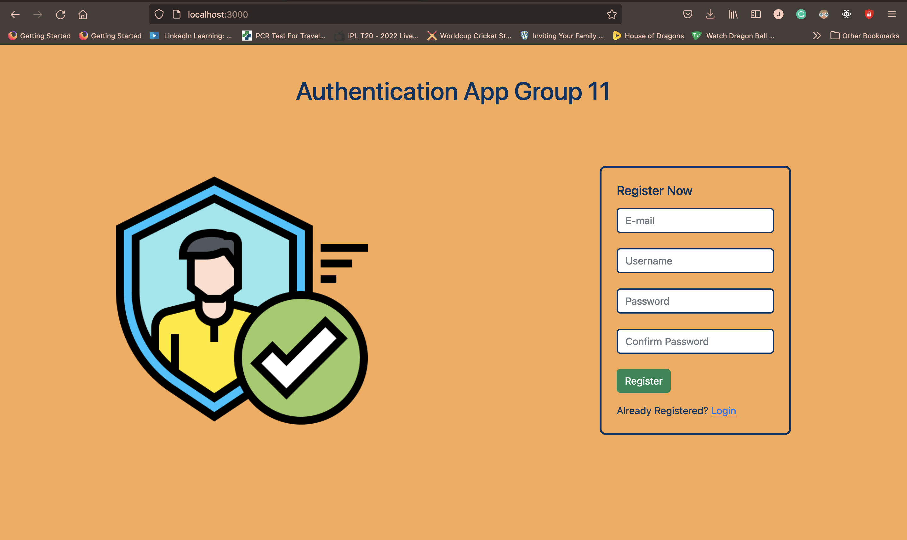
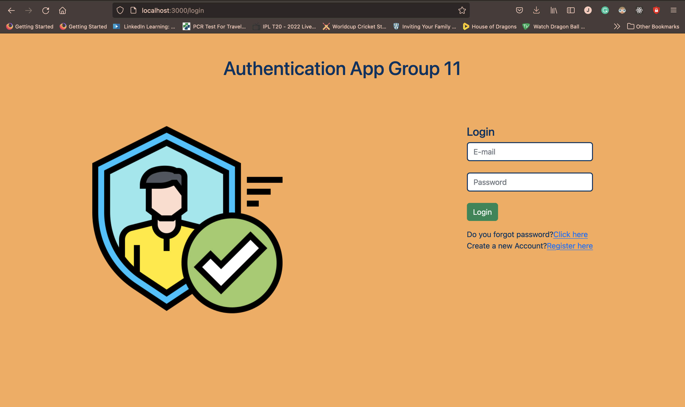
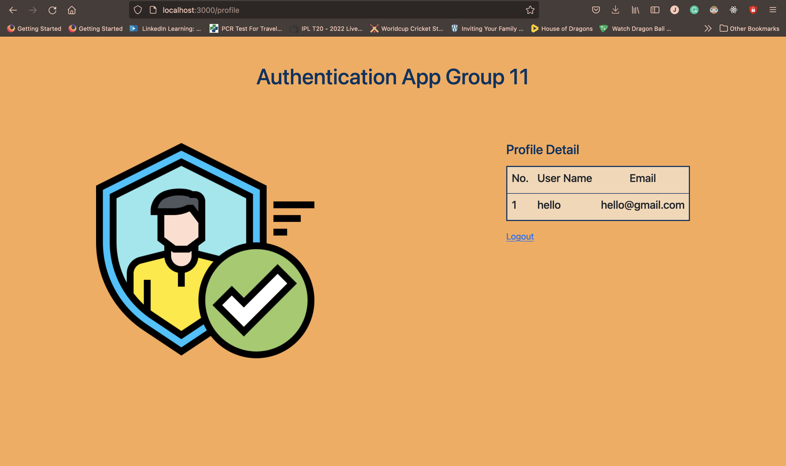
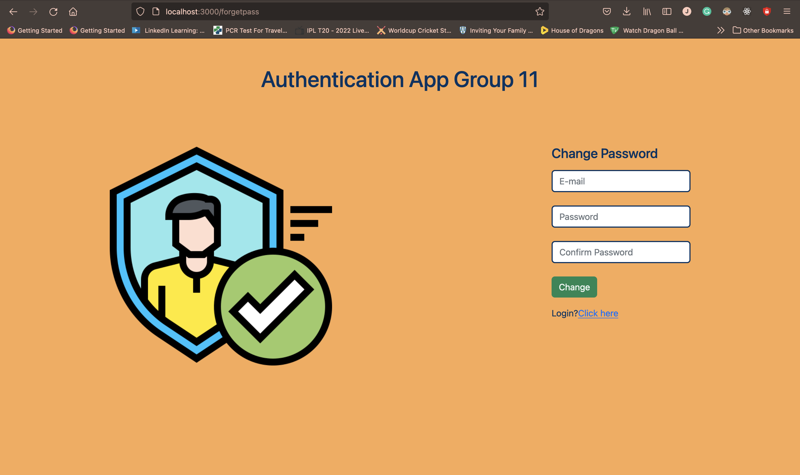

# Auth_App_11
 
Created a simple authentication app with NodeJS, EJS, MongoDB where user can do following things:
 
- Register
 
- Login
 
- Can veiw profile data after login
 
- user can change password by using forget password button
 
 
This app checks whether password matches correctly with the registered email or password when new created.
 
Here are some screenshots of the web app:
 
 
Register Page
 

Login Page
 

Profile Data
 

Forgot Password Page
 

